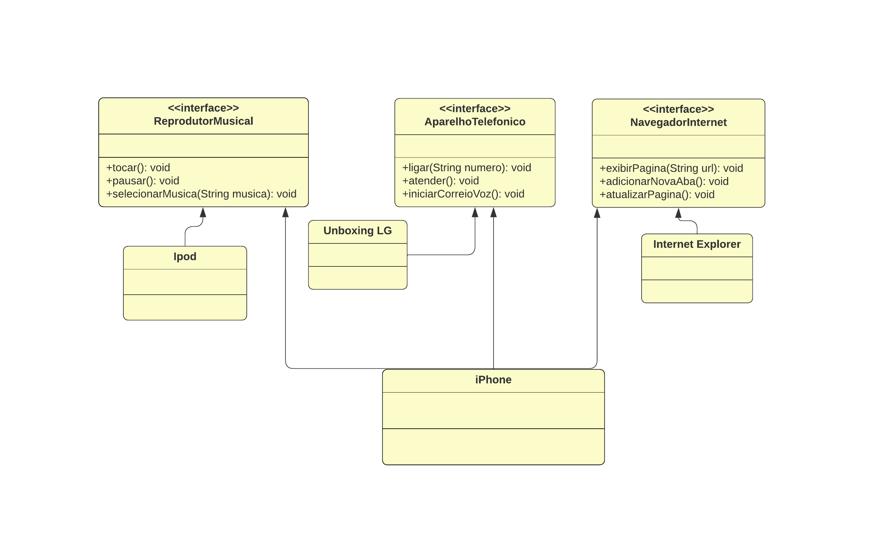

# Projeto-Iphone-Dio

## Projeto Iphone Interface

Realizando através do curso Backend com Java DIO, o instrutor Gleyson Sampaio.

Neste projeto, foi realizando o diagrama UML e o projeto desenvolvido em java, usando a ideia do Steve Jobs. [Lançamento iPhone 2007](https://www.youtube.com/watch?v=9ou608QQRq8), iremos criar o projeto iPhone utilizando a Interface.

